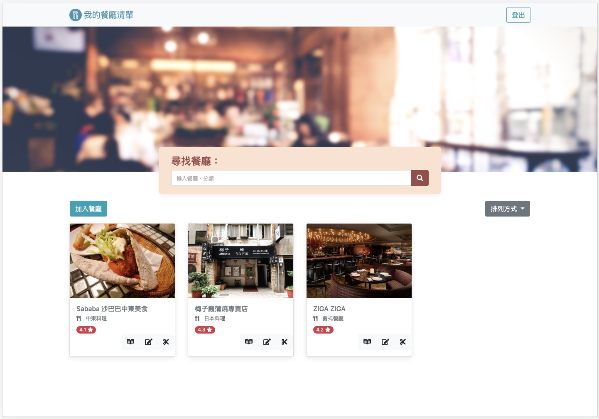

# 餐廳清單 :wink:
### Restaurant List Web
---

---

1. **可以在首頁看到所有餐廳與它們的簡單資料：**
- [ ] 餐廳照片
- [ ] 餐廳名稱
- [ ] 餐廳分類
- [ ] 餐廳評分
  
2. **可以再點進去看餐廳的詳細資訊：**
- [ ] 類別
- [ ] 地址
- [ ] 電話
- [ ] 描述
- [ ] 圖片
 
3. **可以透過搜尋餐廳名稱來找到特定的餐廳**

4. **可以新增喜愛的餐廳**

5. **可以編輯現有餐廳**

6. **可以刪除不想要的餐廳**

7. **可以設定餐廳排序**
- [ ] A->Z
- [ ] Z->A
- [ ] 類別
- [ ] 地區
- [ ] 評分 低至高
- [ ] 評分 高至低
 
8. **可以點擊地址進入 Google Map 查看位置**

9. **擁有使用者認證系統**
- [ ] 使用者可以註冊帳號，註冊的資料包括：名字、email、密碼、確認密碼。其中 email 與密碼是必填欄位，但名字不是
- [ ] 如果使用者已經註冊過、沒填寫必填欄位、或是密碼輸入錯誤，就註冊失敗，並回應給使用者錯誤訊息
- [ ] 使用者也可以透過 Facebook Login 直接登入
- [ ] 使用者的密碼要使用 bcrypt 來處理
- [ ] 使用者必須登入才能使用餐廳清單，如果沒登入，會被導向登入頁面
- [ ] 登入後，使用者可以建立並管理專屬他的一個餐廳清單
- [ ] 使用者登出、註冊失敗、或登入失敗時，使用者都會在畫面上看到正確而清楚的系統訊息
10. **內有種子資料(./models/seeds/seeder.js)，產生兩名使用者與六家餐廳資料**
- [ ] 第一位使用者有 #1, #2, #3 號餐廳
- [ ] 第二位使用者有 #4, #5, #6 號餐廳

---

###### §This code is built with Express

---
